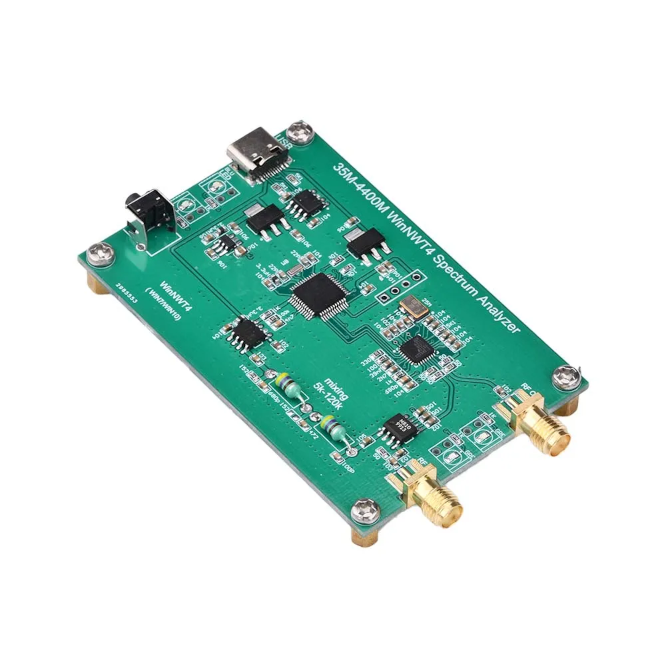
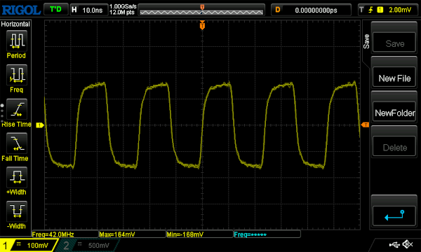

# 35m_4400m Spectrum Analyser Playground

Just a cozy place to play around with firmware for a 35m_4400m spectrum analyzer board.

## The Board

There are many variants out there in the wild.
This one seems to be the most affordable... 
...and it is used for our little games:

_Features_:

- Frequency synthesizer onboard up to 4.4GHz 
    - Only _one_ [adf4351](https://www.alldatasheet.com/datasheet-pdf/pdf/455859/AD/ADF4351.html) onboard  
    - RF Out can be used for signal generation but _not_ for tracking
- STM32 µC
  - [stm32f103c6](https://www.alldatasheet.com/datasheet-pdf/pdf/201588/STMICROELECTRONICS/STM32F103C6.html) Microprocessor
  - 32kB Flash, 10kB SRAM, ARM Core

---
**NOTE**

The board seems to be designed for a different µC Version (most likely stm32f103c8).
Therefore the SPI connection to the adf4351 must be [bit banged](https://en.wikipedia.org/wiki/Bit_banging). 
Or there is a trick I'm not aware of. I am grateful for every hint.
--- 

## Prerequisities

- ST-Link V2 USB connector for STM8 STM32 ([SWD](https://en.wikipedia.org/wiki/Serial_Wire_Debug])) 
- Soldered 4 pin male connector (ST-Link/SWD) 
- Proper IDE installed
  - CMake / GNU toolchain
  - ARM crosscompiler / linker toolchain (Debian/Ubuntu: gcc-arm-none-eabi)
- ST-Link tools installed (Debian/Ubuntu: stlink-tools) 
- [STM32CubeMX](https://www.st.com/content/st_com/en/stm32cubemx.html) installed
- Optional: OpenOCD installed (Debian/Ubuntu: openocd)

_Check_:

    $ st-info --probe
    Found 1 stlink programmers
    version:    V2J45S7
    serial:     AABBCCDDEE
    flash:      32768 (pagesize: 1024)
    sram:       10240
    chipid:     0x123
    dev-type:   STM32F1xx_LD
---

## Act I - Permanent Signal

_Use Case_: Generate a fixed 42MHz RF signal

- Open IDE project (subdir: _sa_35m_4400_act01_)
- Open ioc file with STM32CubeMX and generate code _or_ (if µC different than stm32f103c6) create a new ioc for your µC
- Include C and Header files to your project
  - Inc/sa_35m_4400m_act01.h 
  - Src/sa_35m_4400m_act01.c
- Include procedures into init/loop blocks of main.c:

    ...
    /* USER CODE BEGIN 2 */
    sa_35m_4400m_Init();
    /* USER CODE END 2 */
    
    /* Infinite loop */
    /* USER CODE BEGIN WHILE */
    while (1)
    {
      sa_35m_4400m_Loop();
      /* USER CODE END WHILE */
    ...

- Build your project's ARM target
- Flash (and debug)

    $ /usr/bin/openocd -s /usr/share/openocd/scripts -f ../openocd.cfg -c "tcl_port disabled" -c "gdb_port disabled" -c "tcl_port disabled" -c "program \"$PWD/cmake-build-debug/sa_35m_4400m_act01.elf\"" -c reset -c shutdown

- Have fun with a nice and crisp 42MHz RF signal!
   
    